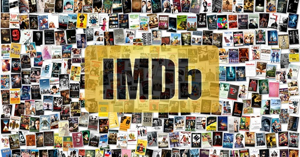
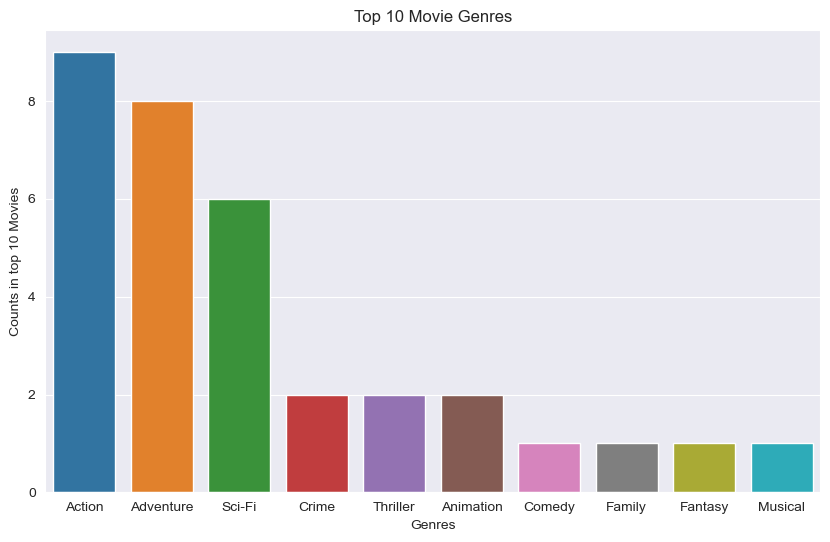
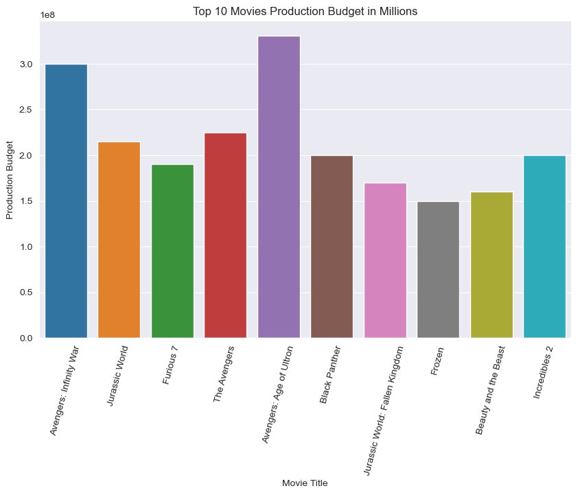
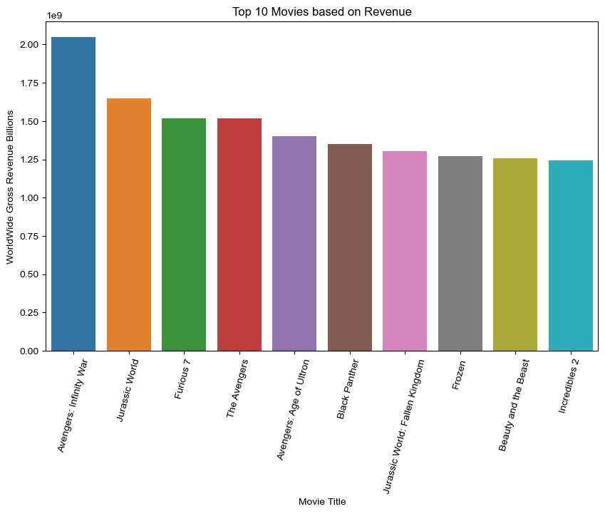

**Blockbuster Insights: Analysis of Top Movies and Genres**

**<u>Overview:</u>**

This data analysis study project aims to explore the fascinating world of film to learn more about the domain of well-known movies and their commercial success. It goes beyond simple popularity to look at the box office performance patterns of blockbuster movies in an effort to identify the elements that led to their enormous success in regards to both its spread and revenues both locally and internationally.Descriptive analysis on the movies' domestic and foreign gross revenues and each studio that made the movies through data primarily fetched from IMDB

**Business Understanding:**

Microsoft may be able to get a considerable amount of revenue and popularity from their first movie.This may in turn create a snowballing effect thus giving it a much larger platform to make even better movies both in terms of quality and quantity.This is done by paying particular attention to profitable box office results and determine the themes, genres, and features that appeal to viewers and generate high revenues at the box office while also looking for prominent directors that have a history of making successful movies.

**Data Understanding:**

Some of the datasources used are primarily from the imdb which is the internet movies database containing tables filled with movies and details of said movies ie ratings and directors.Explored potential secondary sources of data such as box office movies and its revenues that contain both the domestic and foreign gross revenues earned by said movies.

**Data Preparation:**

Used data from the imdb and csv files using descriptive analysis providing a useful overview on the kinds of movies recommended for an initial start and a profitable production and the recommended budget

**Data Analysis:**

**Conclusions:**

Making the first original movie based off of the top three genres namemly- Action,Adventure,Sci-Fi - is recommended to yield the most profitable results

The recommended production budget is approximately 214,060,000$ 

Hiring of directors such as Michael Bay,Christopher Nolan,Sam Mendes,Rob Marshall,J.A. Bayona,Chris Buck,Jennifer Lee,Kyle Balda,Eric Guillon,Ryan Fleck,Anna Boden,Anthony Russo,Joe Russo and Joss Whedon is recommended 
